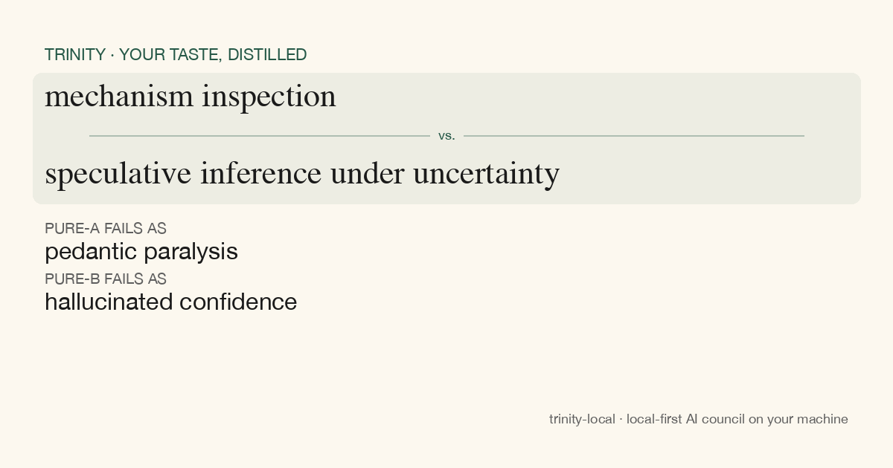

# Trinity Local

> **Trinity asks all your AIs at once, tells you when they agree, and remembers which one you actually trusted.**

Three frontier models answer your prompt in parallel. A chairman synthesizes them into one
verifier-shaped verdict — *agreed claims, disagreed claims, and why the disagreement matters*.
Trinity remembers which model you preferred. Over time it learns your taste and surfaces a
personal `/me` lens you can share — paired tensions like *"leading proxy signal as forecast vs.
official lagging metric as truth"* with named failure modes on each pole.

Local-first. Rides your existing Claude / Gemini / Codex subscriptions. Never sees your
prompts on a server.



## Privacy is the wedge

- **Your prompts and the models' answers never leave your machine.** No exceptions, no opt-in
  tier that changes this.
- **What CAN be opted in (default off):** anonymous categorical routing labels —
  `task_type`, `winner`, `confidence`. No content, ever. Powers a future leaderboard for
  the curious; lives perfectly fine without it.
- **No hosted controller, no per-call billing.** Trinity dispatches via the CLIs you already
  use. The provider eats the inference cost; you keep the preference signal.

## Quickstart (5 commands)

```bash
pip install trinity-local
trinity-local install-mcp           # registers Trinity in Claude Code / Codex / Gemini CLI
trinity-local doctor                # verify providers + auth before your first council
trinity-local council-launch --task "Should I use SQLite or DuckDB for analytics?"
trinity-local me-build              # surface your taste lenses (after a few councils)
trinity-local me-card                # render your /me lens as a 1200×630 PNG to share
```

`trinity-local doctor` checks each provider CLI is installed + authenticated, the MCP server
dependency is present, and your Trinity directory is writable — surfaces a one-line fix for
each ✗ before you hit a live council.

### One-shot skill install (Claude Code)

If you'd rather drive the whole thing from inside Claude Code, drop the `trinity` skill into
your global skills directory and type `/trinity` at the prompt — it does the `pip install`,
the `install-mcp`, and `doctor` in sequence:

```bash
mkdir -p ~/.claude/skills/trinity
curl -fsSL https://raw.githubusercontent.com/openclaw/trinity-local/main/.claude/skills/trinity/SKILL.md \
  -o ~/.claude/skills/trinity/SKILL.md
# Then in Claude Code: /trinity
```

## How is this different from \[X\]

| | Trinity Local | LMArena | promptfoo / Claude evals | OpenRouter | Karpathy LLM Council |
|---|---|---|---|---|---|
| Data source | **Your own prompts** | Crowd votes | Test fixtures | n/a (router) | Yours, but no persistence |
| Cost basis | Your own subscriptions | Hosted | Per-call API | Per-call API | Per-call API |
| Output | **Verifier-shaped Routing JSON + your `/me` lens** | Win-rate ranking | Pass/fail per case | Cheapest route | Three answers + summary |
| Privacy | **Prompts never upload** | n/a | n/a | Prompts route through their servers | Hosted |
| Personalization | **Personal routing table improves with use** | One global ranking | Per-test-suite | None | None |
| Shareable artifact | **`/me` lens PNG card** | Leaderboard link | Eval report | n/a | Per-prompt summary |

If you want "which model is best in general," LMArena. If you want "which model handles **this
codebase / this voice / this trade-off you keep making**," Trinity.

## What a council produces

Every council writes:

1. **Per-model answers** — Claude / Gemini / Codex each respond. Streamed as they finish; no
   waiting on the slowest member to read the fastest.
2. **Chairman synthesis** — *winner / runner-up / confidence / per-provider scores*, plus
   structured `agreed_claims`, `disagreed_claims` (with `why_matters`), `routing_lesson`, and
   `eval_seed` (the deterministic test a future answer should pass).
3. **A Routing JSON outcome** persisted to `~/.trinity/council_outcomes/<id>.json`. This is
   the moat — cross-model preference data frontier providers can't see.

After enough councils:

- A **personal routing table** emerges: *"For code_refactor prompts, Claude wins 7.8 / 10."*
- A **`/me` lens** distills your taste into paired tensions across domains, with the
  failure mode of pure-A and pure-B explicit. Run `trinity-local me-card` to render it as a
  shareable PNG.

## Demo

[60-second screen recording — coming on launch day]

## How to use it inside Claude Code

```
mcp__trinity-local__run_council(
  task="Compare three database options for a 50M-row analytics workload: Postgres, SQLite, DuckDB",
  members=["claude", "gemini", "codex"]
)
```

Or via the CLI:

```bash
trinity-local council-launch --task "..." --members claude gemini codex
```

After the council finishes, the user clicks the answer they preferred. That click feeds
`record_outcome` and Trinity's chairman gets smarter at picking *the right model for this
flavor of question* next time.

## Architecture (one paragraph)

The chairman model is the verifier, emitting structured Routing JSON over every council.
Members run in parallel (or in `chain` mode for sequential refinement). The personal routing
table is computed on demand from `~/.trinity/council_outcomes/*.json` — no separate state
file. The `/me` lens-discovery pipeline (4 stages: basins → decisions → pair-mining →
basin post-filter) ratifies tensions that span ≥3 topical basins. Stage 0 turn-pair gap
extraction (REFRAME / COMPRESSION / REDIRECT / SHARPENING) feeds high-signal behavioral
evidence into decision extraction.

For full architecture: [`claude.md`](claude.md) (agent context) and
[`docs/scale-plan.md`](docs/scale-plan.md) (long-form roadmap).
For the v2 next-layer (skill graduation via the Loop Constitution double-loop):
[`docs/v2-loop-constitution.md`](docs/v2-loop-constitution.md).

## What's next (v2-alpha)

> *Inversion, cull, and eviction are the wind.*

v2 turns Trinity from evidence ledger into skill factory. A double-loop graduates skills with
their own passing test, evicts them when a new model lands. CLI today:
`trinity-local loop frame --intent "<what skill to build>"`. Skills land at
`~/.trinity/skills/<id>/`. Spec: [`docs/v2-loop-constitution.md`](docs/v2-loop-constitution.md).

## Help

| Command | What it does |
|---|---|
| `trinity-local doctor` | Pre-flight checks; surfaces a fix line per ✗ |
| `trinity-local council-launch --task "..."` | Run a council from the terminal |
| `trinity-local me-build` | Build your `/me` lens from prompt history |
| `trinity-local me-card` | Render your strongest lens as a PNG |
| `trinity-local portal-html --open` | Open the launchpad |
| `trinity-local status` | Aggregate scoreboard, recent councils |
| `trinity-local --help` | Full command list |

## License

MIT — see [`LICENSE`](LICENSE).

## Building Trinity

Issues, traces, weird outputs, lens shares — all welcome at the GitHub repo. The product
gets better as more people run councils against their own taste; cross-pollinating outputs
on socials is how the network effect compounds.

If you want to read what Trinity thinks of itself, every architecture decision in this
repo cites a council outcome ID. Examples in `claude.md`. Yes, it's councils all the way
down.
